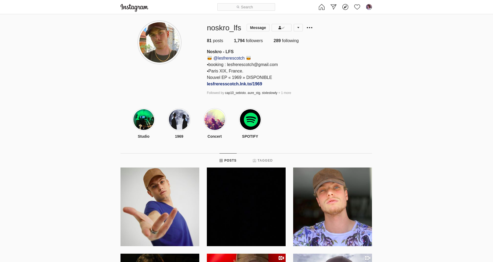

# Instagram copy

## Model:



## Project

```
Project
│   README.md
│   package.json
|   package-lock.json
└─── src
│     │
│     └─── components
|     |       └─── icons
|     |       │      └─── FontAwesomeIcons.jsx
│     |       └─── header
│     |       │      └─── Header.jsx
│     |       └─── main
│     |              └─── Main.jsx
│     |              │
│     |              └─── profile
│     |              │        └─── Profile.jsx
│     |              │        └─── ProfileInfo.jsx
│     |              │        └─── ProfileInfo.text.jsx
│     |              │        └─── ImageBar.jsx
│     |              │
│     |              └─── gallery
|     |                      └─── Gallery.jsx
|     |                      └─── Nav.jsx
|     |
|     └─── App.js
|     └─── index.js
|     └─── App.css
|
└─── public
       └─── index.html
       └─── images
```

### `npm start`

Runs the app in the development mode.<br />
Open [http://localhost:3000](http://localhost:3000) to view it in the browser.

The page will reload if you make edits.<br />
You will also see any lint errors in the console.
